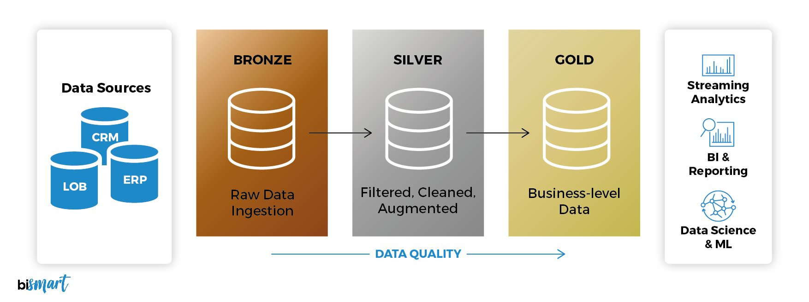
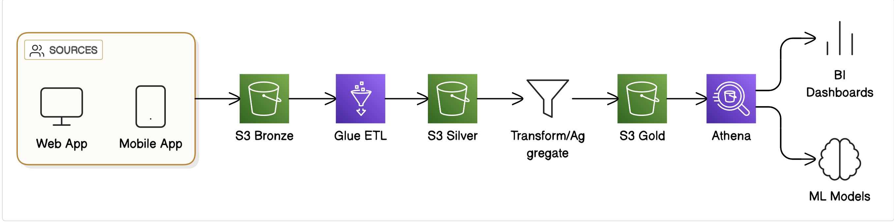

# Medallion Architecture On AWS

**Building Modern Data Lakes on AWS S3 with the Medallion Architecture**

**Introduction**

Data constitute the foundation of contemporary enterprises. However as the volume,
velocity, and variety of data grow, organizations face a critical
challenge: **how to store, manage, and analyze data efficiently at
scale**.

**data lakes** which is a centralized repository is used to stored  structured, 
semi-structured, and unstructured data in their raw form. When combined with **AWS S3** 
and the **Medallion architecture**, this approach provides **scalable, reliable, and layered approach** 
for transforming raw data into insights ready for analysis.

In this post, we'll explore:

-   Why S3 is the go-to storage for modern data lakes

-   The Medallion architecture and its layers (Bronze, Silver, Gold)

-   Practical design patterns, best practices, and real-world use cases

-   How AWS services integrate seamlessly with S3-based data lakes

**1. Why AWS S3 for Data Lakes?**

Amazon S3 (Simple Storage Service) is **object storage** that offers:

-   **Unlimited storage** -- scale from gigabytes to petabytes of data without distruption

-   **High durability** -- 11 nines of durability (99.999999999%)

-   **Flexible storage classes and formats** -- Standard, Infrequent Access, Glacier etc classes and can stores data 
    in CSV ,JSON ,Parquet ,ORC etc formats.

-   **Secure and compliant** -- encryption at rest and transit(SSE-S3/SSE-KMS), IAM
    policies, and fine-grained access control

-   **Integration with analytics and AI/ML services** -- Intergrates seamlessly with AWS services like Glue, Athena,
    Redshift Spectrum, EMR, SageMaker, Kinesis and MSK

**Why S3 is perfect for a data lake:**

-   **Any format**: can be stored: CSV, JSON, Parquet, Avro, ORC, images, audio,
    logs

-   **Decouples compute and storage** -- separates computation from storage so that different analytics engines can 
    access the same raw data without having to move it.

-   **Supports schema-on-read** -- The schema is defined during querying, not during writing

**2. Overview of the Medallion Architecture**

A **layered approach** to organising your data lake is the **Medallion Architecture**. To enhance **data quality, governance, and performance** , 
it arranges data into several **refined layers**.

The layers are:

**2.1 Bronze Layer -- Raw Data**

-   **Purpose:** Ingest all raw data exactly as it was obtained from sources.

-   **Data Characteristics:**

    -   Semi-structured or unstructured

    -   May contain duplicates, errors, or missing values

    -   Timestamped to monitor ingestion

-   **Use Cases:**

    -   Audit trail

    -   Unprocessed logs and events

    -   Origin of downstream transformations

-   **Example in S3:**

-   s3://your-datalake/bronze/customers/

-   s3://your-datalake/bronze/orders/

**2.2 Silver Layer -- Data that has been conformed and cleaned**

-   **Purpose:** Transform raw data into **The goal is to create clean, standardised, and enriched databases from raw data.**

-   **Data Characteristics:**

    -   Deduplicated

    -   Corrected data types

    -   Enhanced using lookups or joins

    -   Consistent timestamps and formats

-   **Use Cases:**

    -   Intermediate analytics

    -   Providing data to BI dashboards

-   **Example in S3:**

-   s3://your-datalake/silver/customers/

-   s3://your-datalake/silver/orders/

**Typical transformations:**

-   Filter out bad or null records

-   Standardise currencies and timestamps.

-   Join with reference tables (like product categories)

-   Verify using business rules

**2.3 Gold Layer -- Business-Level / Analytics Data**

-   **Purpose:** Create **analytics-ready, aggregated, or curated data**

-   **Data Characteristics:**

    -   Fully cleansed, trustworthy, and aggregated

    -   Optimized for reporting or machine learning

    -    For quicker enquiries, data is frequently stored in **columnar formats** (Parquet, ORC).

-   **Use Cases:**

    -   BI dashboards and reports

    -   ML training datasets

    -   KPI calculation and trend analysis

-   **Example in S3:**

-   s3://your-datalake/gold/sales_summary/

-   s3://your-datalake/gold/customer_lifetime_value/

**Typical transformations:**

-   Aggregation on daily, weekly, or monthly

-   Join many silver tables to build fact tables

-   Compute metrics like revenue, churn, or retention

**3. AWS Services that Complement S3 Data Lakes**

Building a Medallion architecture on S3 works best when combined with
AWS analytics services:

  -----------------------------------------------------------------------
  **Service**           **Role in Data Lake**
  --------------------- -------------------------------------------------
  **AWS Glue**          ETL/ELT jobs to transform Bronze → Silver → Gold

  **Amazon Athena**     Query S3 data directly using SQL without moving
                        it

  **Amazon Redshift     Query S3 data as external tables in Redshift
  Spectrum**            

  **Amazon EMR**        Distributed Spark/Hadoop processing for
                        large-scale transformations

  **AWS Lake            Centralized access control, data catalog, and
  Formation**           governance

  **Amazon QuickSight** BI dashboards on curated Gold data
  -----------------------------------------------------------------------

**4. Practical S3 Design Patterns**

**4.1 Partitioning**

-   Organize large datasets for query performance

-   Common partitions: year=2025/month=11/day=30/

-   Example:

-   s3://my-datalake/silver/orders/year=2025/month=11/day=30/orders.parquet

**4.2 File Formats**

-   **Bronze:** raw JSON, CSV, log files

-   **Silver:** Parquet or ORC (columnar)

-   **Gold:** Parquet with compression (Snappy)

**4.3 Naming Conventions**

-   s3://\<bucket\>/\<layer\>/\<entity\>/year=YYYY/month=MM/day=DD/

-   Helps Athena, Glue Crawlers, and partition pruning

**5. Example Data Flow (End-to-End)**

1.  **Bronze Layer:** S3 ingests raw data from sources (e.g., Kafka,
    APIs, IoT)

2.  **Glue ETL:** Cleanses, deduplicates, and standardizes → Silver
    Layer

3.  **Silver Layer:** Curated, conformed tables available for analytics

4.  **Gold Layer:** Aggregations, business KPIs, and ML datasets

5.  **Analytics:** Athena queries, Redshift reports, QuickSight
    dashboards

**Diagram Concept:**

**6. Best Practices for Medallion Data Lakes on S3**

1.  **Use separate buckets or prefixes per layer** (Bronze/Silver/Gold)

2.  **Partition and compress data** for performance and cost savings

3.  **Enforce data validation rules** in Silver ETL

4.  **Track metadata** with Glue Catalog or Lake Formation

5.  **Secure access** using IAM policies, S3 bucket policies, and KMS
    encryption

6.  **Use consistent naming conventions** across layers and datasets

7.  **Version your data** if necessary (append date/time to files for
    auditability)

**7. Real-World Example**

**E-Commerce Data Lake:**

-   Bronze: raw JSON order events from web or mobile apps

-   Silver: deduplicated, validated orders joined with product catalog

-   Gold: aggregated revenue by category, daily sales metrics, customer
    LTV

-   Analytics: Quicksight dashboards for executives, Athena queries for marketing

**Conclusion**

combining **AWS S3 and the Medallion architecture** provides a
**scalable, structured, and reliable foundation** for modern data
analytics.

-   S3 gives **unlimited storage and flexibility**

-   Medallion layers ensure **data quality, governance, and analytics
    readiness**

-   Integration with **Glue, Athena, Redshift, and QuickSight** enables
    **end-to-end insights**

By implementing this architecture, organizations can build
**enterprise-grade data lakes**, reduce time-to-insight, and empower
data-driven decision-making.
